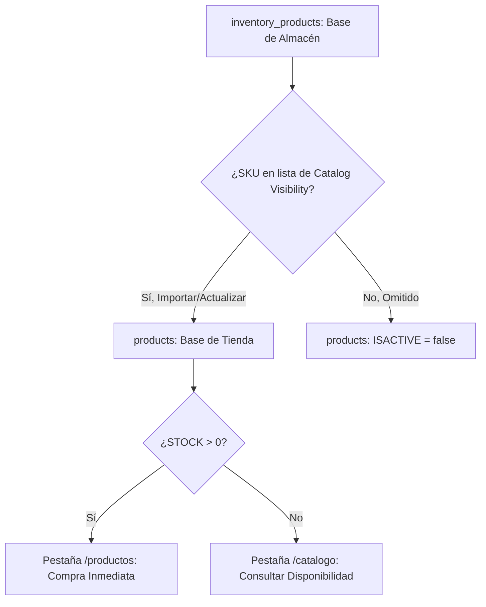
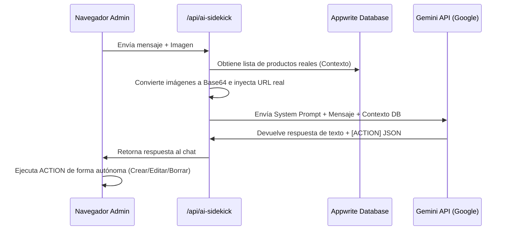

# CONTEXTO COMPLETO PARA IA: ARQUITECTURA FRONTEND Y PANEL DE ADMINISTRACIÓN (YAXSEL WEB-STORE)

Este documento maestro contiene 10 secciones extensas diseñadas para proporcionar a cualquier modelo de Inteligencia Artificial un contexto completo, profundo y detallado de la arquitectura de software, flujos de datos, integraciones de base de datos (Appwrite) y la lógica de negocio del frontend y la administración del proyecto Yaxsel Web-Store.

---

## 📑 ÍNDICE DE SECCIONES (LOS 10 DOCUMENTOS)

*   **DOCUMENTO 1:** Introducción, Tecnologías Clave y Arquitectura de Directorios
*   **DOCUMENTO 2:** Sistema de Datos de Appwrite (Base de Datos, Colecciones y Bucket)
*   **DOCUMENTO 3:** Lógica de Productos y Control de Visibilidad (Tienda con Stock vs. Catálogo a Pedido)
*   **DOCUMENTO 4:** Sistema Multitemplático y Temas Dinámicos de la Interfaz
*   **DOCUMENTO 5:** Arquitectura Detallada de la Administración (Panel Shopify-Dark y sus 35+ Módulos)
*   **DOCUMENTO 6:** Rutas Públicas del Frontend (Rutas, Vistas y Componentes Clave)
*   **DOCUMENTO 7:** Manejo del Estado Global y Contextos de React (Carrito debounceado, Favoritos, Notificaciones)
*   **DOCUMENTO 8:** Ecosistema de Marketing, Puntos de Fidelidad y Categorización VIP
*   **DOCUMENTO 9:** Integración con Inteligencia Artificial (Yexy Asistente Autónomo y API de Gemini)
*   **DOCUMENTO 10:** Guía de Desarrollo para la IA: Reglas de Código, Límites de Petición y Buenas Prácticas

---

# DOCUMENTO 1: Introducción, Tecnologías Clave y Arquitectura de Directorios

El proyecto **Yaxsel Web-Store** es un e-commerce altamente creativo e interactivo estructurado bajo las especificaciones de diseño y rendimiento de 2026. Está construido sobre **Next.js (App Router)** usando **TypeScript**, estilizado con **Tailwind CSS** y **Vanilla CSS**, y motorizado por **Appwrite Cloud** en el backend.

### Stack Tecnológico
1.  **Core**: Next.js 15 (App Router), React 19, TypeScript.
2.  **Base de Datos y Autenticación**: Appwrite Cloud (nyc.cloud.appwrite.io).
3.  **Animación**: GreenSock Animation Platform (GSAP), ScrollTrigger, Lenis (Smooth Scroll).
4.  **UI**: Lucide React para iconografía consistente, componentes premium con degradados suaves (OKLCH y CIELAB).
5.  **AI**: Modelos Gemini (Gemini 2.5 Flash, Gemini 3.1 Flash Lite) para el Sidekick Autónomo.

---

### 📂 Estructura de Directorios

El codebase está diseñado de manera modular y limpia:

```
web-store/
├── public/                 # Recursos estáticos (imágenes, videos, fuentes)
├── src/
│   ├── app/                # Enrutamiento principal (App Router)
│   │   ├── admin/          # Panel de administración de la tienda
│   │   │   ├── (panel)/    # Subrutas protegidas (35 módulos de control)
│   │   │   ├── configure/  # Configuración inicial del SDK de Appwrite
│   │   │   └── login/      # Acceso administrativo exclusivo
│   │   ├── api/            # Endpoints locales del servidor Next.js
│   │   │   ├── ai-sidekick/# Endpoint del asistente autónomo Yexy
│   │   │   ├── template/   # Control seguro de plantillas activas
│   │   │   └── gemini/     # Integración genérica con modelos de IA
│   │   ├── carrito/        # Vista del carrito de compras
│   │   ├── catalogo/       # Vista de productos disponibles a pedido (sin stock)
│   │   ├── productos/      # Catálogo público con stock disponible
│   │   └── layout.tsx      # Layout raíz del frontend público
│   ├── components/         # Componentes de interfaz (compartidos y de admin)
│   ├── context/            # Proveedores de estado global (Cart, Auth, Favorites, Templates)
│   ├── hooks/              # Custom hooks de React (useAuth, useAperturaPromotion)
│   ├── lib/                # Utilidades, adaptadores y clientes SDK
│   │   ├── appwrite.ts     # Configuración de Appwrite para el lado del cliente
│   │   ├── appwrite-admin.ts# Clientes proxy de Appwrite con soporte SSR/CSR
│   │   └── appwrite-server.ts# Operaciones nativas del servidor (Admin SDK)
│   ├── services/           # Capas de abstracción de APIs externas (loyalty, notifications)
│   ├── templates/          # Las 13 variaciones de páginas de inicio prediseñadas
│   └── types/              # Declaraciones e interfaces de TypeScript
```

---

# DOCUMENTO 2: Sistema de Datos de Appwrite (Base de Datos, Colecciones y Bucket)

La aplicación almacena sus configuraciones y datos en un único proyecto de Appwrite. Los identificadores por defecto apuntan a:
*   **Endpoint**: `https://nyc.cloud.appwrite.io/v1`
*   **Project ID**: `6a0a4e8d0032177f3f90`
*   **Database ID**: `6a0a58ca001798410d86`

### 🗄️ Mapeo de Colecciones de Appwrite
El archivo [appwrite.ts](file:///C:/Proyectos/PROJECT%20YAXSEL/web-store/src/lib/appwrite.ts) y [appwrite-admin.ts](file:///C:/Proyectos/PROJECT%20YAXSEL/web-store/src/lib/appwrite-admin.ts) mapean las siguientes colecciones clave:

| Colección en Appwrite | Variable en Código | Propósito | Atributos Críticos |
| :--- | :--- | :--- | :--- |
| `products` | `PRODUCTS_COLLECTION` | Base de datos pública de productos expuestos en el sitio. | `NAME` (String), `PRICE` (Double), `CURRENTPRICE` (Double), `STOCK` (Integer), `ISACTIVE` (Boolean), `sku` (String), `IMAGEURL` (String), `CATEGORYID` (String), `SUBCATEGORYID` (String), `COMING_SOON` (Boolean). |
| `inventory_products` | `INVENTORY_PRODUCTS_COLLECTION` | Base de datos maestra del almacén físico ("Bodegapp"). | Estructura similar a `products` pero contiene costes reales y niveles exactos de almacén central. No todo lo que está aquí se expone en la tienda. |
| `categories` | `CATEGORIES_COLLECTION` | Categorías de la tienda. | `name` (String), `iconUrl` (String), `order` (Integer), `BACKGROUND_IMAGE_URL` (String). |
| `subcategories` | `SUBCATEGORIES_COLLECTION` | Subcategorías asignadas a una categoría. | `name` (String), `categoryId` o `CATEGORYID` (String). |
| `orders` | `ORDERS_COLLECTION` | Pedidos registrados. | `userId` (String), `items` (JSON), `status` (String), `total` (Integer), `paymentMethod` (String), `comprobanteUrl` (String), `index` (Integer). |
| `discount_coupons` | `COUPONS_COLLECTION` | Cupones de descuento. | `CODE` (String), `DISCOUNT_PERCENT` (Integer), `IS_ACTIVE` (Boolean). |
| `points_store_items` | `POINTS_STORE_COLLECTION` | Productos canjeables por puntos. | `name` (String), `pointsCost` (Integer), `stock` (Integer). |
| `users` | `USERS_COLLECTION` | Clientes registrados. | `email` (String), `points` (Integer), `role` (String), `isWholesale` (Boolean), `loyaltyLevel` (String). |
| `live_raffles` | `RAFFLES_COLLECTION` | Sorteos interactivos activos. | `title` (String), `isActive` (Boolean), `pointsCost` (Integer). |
| `stock_alerts` | `STOCK_ALERTS_COLLECTION` | Solicitudes de disponibilidad de catálogo. | `userId` (String), `productId` (String), `requestedAt` (Integer). |
| `cart_snapshots` | `CART_SNAPSHOTS_COLLECTION` | Copia de seguridad instantánea del carrito del usuario. | `userId` (String), `itemsJson` (String), `itemCount` (Integer), `updatedAt` (Integer). |
| `theme_config` | `THEME_CONFIG_COLLECTION` | Ajustes de estilo activos de la tienda. | `templateId` (Integer), `primaryColor` (String), `themeMode` (String). |

### 📁 Almacenamiento Unificado (Storage Bucket)
El e-commerce gestiona todos los archivos multimedia en **un único bucket**:
*   **Media Bucket ID**: `6a15f9a5001070a3c408`

Para mantener la organización, los recursos se organizan utilizando **prefijos** en los nombres de archivo mediante el objeto `MEDIA_PREFIXES`:
```typescript
export const MEDIA_PREFIXES = {
  products: 'products/',
  banners: 'banners/',
  categories: 'categories/',
  comprobantes: 'comprobantes/',
  thumbnails: 'thumbnails/',
  chat: 'chat/',
} as const;
```

---

# DOCUMENTO 3: Lógica de Productos y Control de Visibilidad (Tienda con Stock vs. Catálogo a Pedido)

Una de las características más avanzadas del diseño de Yaxsel es la división conceptual entre **Productos con Stock** (Tienda Inmediata) y **Productos a Pedido** (Catálogo Exclusivo).



### 1. Vista /productos (Tienda Inmediata)
Muestra únicamente aquellos productos con existencia física listos para despacho:
*   **Filtro en base de datos**: `ISACTIVE == true` y `STOCK > 0`.
*   **Acción del usuario**: Se añade al carrito directamente y se completa la compra.

### 2. Vista /catalogo (Catálogo Exclusivo)
Muestra productos del inventario de bodega que **no disponen de stock** pero de los cuales se conoce el proveedor o bodega central:
*   **Filtro en base de datos**: `ISACTIVE == true`, `STOCK <= 0`, y `COMING_SOON == false`.
*   **Acción del usuario**: "Consultar disponibilidad". Al estar registrado, el usuario hace clic y crea un documento en `stock_alerts`. Esto notifica al administrador del interés en dicho SKU. Si el administrador adquiere stock del producto, lo transfiere al flujo regular de `/productos` incrementando su valor de stock.

### 3. Sincronización en la Administración (/admin/catalog-visibility)
El panel de visibilidad de catálogo permite actualizar masivamente cuáles productos del inventario maestro (`inventory_products`) deben publicarse en la base pública (`products`):
1.  El administrador pega una **lista de SKUs** separados por saltos de línea.
2.  El sistema analiza y clasifica:
    *   **Por importar**: Productos que existen en `inventory_products` pero no se han creado en `products`. Se clonan con `ISACTIVE: true`.
    *   **Por activar**: Productos que ya existen en `products` pero estaban inactivos. Se actualizan a `ISACTIVE: true`.
    *   **Por ocultar**: Productos en `products` que NO figuran en la lista de SKUs pegados por el administrador. Se actualizan a `ISACTIVE: false`.
3.  El sistema incluye un algoritmo de reintento exponencial (`executeWithRetry`) para evitar errores **429 (Too Many Requests)** al realizar las escrituras masivas en Appwrite.

---

# DOCUMENTO 4: Sistema Multitemplático y Temas Dinámicos de la Interfaz

Yaxsel Web-Store no posee un diseño rígido. Cuenta con **13 variaciones de página de inicio (plantillas)** completamente operativas, accesibles mediante `TemplateContext` e inyectadas dinámicamente en el componente principal `DynamicHomePage`.

### 🎨 Plantillas Disponibles (`src/templates/`)
*   **Plantilla 1**: Estilo minimalista enfocado en perfumería y cosmética de lujo.
*   **Plantilla 2 (Shopify-Dark)**: Fondo oscuro pulido con acentos profesionales.
*   **Plantilla 3**: Enfoque de alta conversión con banners y rejillas de categorías destacadas.
*   **Plantilla 4 (Glassmorphism)**: Diseño futurista con tarjetas translúcidas basadas en efectos de desenfoque de fondo.
*   **Plantilla 5 (Seoul Boutique/Cream)**: Estética boutique asiática en tonos pastel y cremas suaves (`#fdfbf7`).
*   **Plantillas 6 a 13**: Alternativas optimizadas para ofertas de temporada, colecciones de moda, electrónica y promociones de apertura masiva.

### ⚙️ Lógica de Control y Sobrescritura
El archivo [TemplateContext.tsx](file:///C:/Proyectos/PROJECT%20YAXSEL/web-store/src/context/TemplateContext.tsx) resuelve el tema dinámicamente:
1.  **Parámetro URL**: Permite una sobrescritura instantánea en tiempo real a través de `?_tpl=NUMBER` (útil para el editor de temas interactivos en iframe de administración).
2.  **Base de Datos**: Si no hay parámetro de URL, consume el endpoint `/api/template` que devuelve el `templateId` guardado de la colección `theme_config` de Appwrite.
3.  **Control del Body**: Al activarse el template, ajusta algorítmicamente el color de fondo y el color del texto del `document.body` para garantizar una consistencia absoluta.

---

# DOCUMENTO 5: Arquitectura Detallada de la Administración (Panel Shopify-Dark y sus 35+ Módulos)

El panel administrativo en `src/app/admin/(panel)` es el núcleo logístico de la tienda. Presenta una interfaz oscura premium ("Shopify-Dark") optimizada visualmente mediante animaciones fluidas de **GSAP** y dividida estructuralmente en tres grandes agrupaciones lógicas en la barra lateral:

### 1. Módulos Generales y Logística
*   **Inicio (/admin/dashboard)**: Indicadores de venta en tiempo real, recuento de pedidos diarios y alertas.
*   **Módulo de Productos**:
    *   `products`: Catálogo general de productos y su edición unitaria.
    *   `catalog-visibility`: Consola de control para visibilidad masiva de SKUs.
    *   `wholesale-products`: Gestión dedicada del stock y precios para clientes mayoristas.
    *   `inventory`: Monitor de "Bodegapp", sincronización rápida.
    *   `categories` y `subcategories`: Creación de la estructura organizativa de la tienda.
    *   `import-jumpseller`: Subida y mapeo masivo de CSV de inventario.
    *   `bulk-delete` / `bulk-edit`: Acciones masivas sobre precios, stock e imágenes.
    *   `stock-editor` / `pack-qty`: Controladores del empaquetado y existencias.
*   **Pedidos (/admin/orders)**: Cola de preparación de compras. Muestra el estado del pago, datos del remitente y permite exportar PDF de envío mediante `generateOrderPdf.ts`.
*   **Mi Tienda (/admin/store-settings)**: Configura datos de contacto persistentes a través de la base de datos (se inyecta en la barra superior pública).

### 2. Marketing y Fidelidad
*   **Cupones (/admin/coupons)**: Panel de cupones con porcentaje de descuento programable.
*   **Ofertas Temporales (/admin/timed-offers)**: Promociones flash controladas por cronómetros con fecha de expiración.
*   **Apertura (/admin/apertura)**: Módulo promocional global para aplicar descuentos masivos y cambiar de tema en celebraciones de inauguración.
*   **VIP (/admin/vip)**: Segmentación e identificación de los usuarios de mayor consumo.
*   **Notificaciones (/admin/notifications)**: Gestión de alertas push y notificaciones en base de datos para la aplicación.

### 3. Interacción y Engagement
*   **Live Shopping (/admin/live)**: Transmisión y listado de streams interactivos.
*   **Clips / Videos (/admin/clips)**: Formato de video vertical (similar a TikTok/Instagram Reels) para presentar productos dinámicamente en el frontend.
*   **Reseñas (/admin/reviews) y Preguntas (/admin/questions)**: Gestión de comentarios y soporte de dudas técnicas.

---

# DOCUMENTO 6: Rutas Públicas del Frontend (Rutas, Vistas y Componentes Clave)

El lado del cliente expone una serie de páginas altamente interactivas e integradas de forma responsive para cualquier dispositivo móvil o de escritorio.

### 🛣️ Mapeo de Páginas Clave
*   **Inicio (`/`)**: Página de entrada controlada por `DynamicHomePage` y el selector multitemplático.
*   **Productos (`/productos`)**: Tienda tradicional. Cuenta con filtros interactivos por categoría, subcategoría y una barra de búsqueda ultra-rápida. Muestra únicamente elementos con `STOCK > 0`.
*   **Catálogo Exclusivo (`/catalogo`)**: Catálogo consultivo de bodega. Al no poseer stock físico, el botón de compra es sustituido por "Consultar disponibilidad" que se registra en `stock_alerts`.
*   **Detalle de Producto (`/producto/[id]`)**: Ficha extendida. Integra:
    *   `ImageZoomModal` para observar detalles de los productos.
    *   `ProductTabs` con descripción, información de despacho y reseñas.
    *   `ProductQuestions` para la sección integrada de preguntas y respuestas.
*   **Clips (`/clips`)**: Sección de videos cortos verticales. Los usuarios pueden desplazarse hacia abajo de forma infinita, dar me gusta y pulsar un botón flotante para añadir el producto del video directamente al carrito de compras.
*   **Carrito de Compras (`/carrito` / `CartDrawer`)**: Resumen lateral o en página completa con cálculo automático de envíos, desglose de promociones y soporte para añadir notas de despacho.

---

# DOCUMENTO 7: Manejo del Estado Global y Contextos de React

La tienda controla sus estados más importantes utilizando Contextos de React integrados directamente en el layout raíz de la aplicación.

### 🛒 CartContext: Lógica de Carrito Debounceada
El archivo [CartContext.tsx](file:///C:/Proyectos/PROJECT%20YAXSEL/web-store/src/context/CartContext.tsx) destaca por su optimización de llamadas de backend:
1.  **Carga Rápida**: Al montarse, lee inmediatamente el carrito persistido localmente en `localStorage` con la clave `yaxsel_cart`.
2.  **Recuperación en Servidor**: Al autenticarse el cliente, lee de la colección `cart_snapshots` de Appwrite para verificar si el usuario tiene una sesión de carrito persistente en la nube y fusionar los productos.
3.  **Debounce de 10 Segundos**: Cuando se añade, elimina o cambia la cantidad de un producto, la persistencia en base de datos **no ocurre de forma síncrona** en cada clic. Se activa un temporizador de **10 segundos**. Si no hay más interacciones, se genera un único documento ligero JSON en `cart_snapshots`.
    *   Esto elimina por completo las caídas del sistema por exceso de peticiones (Rate Limit 429) cuando un usuario incrementa rápidamente el número de unidades de un producto en el carrito.
4.  **Cálculo de Promociones**: Evalúa en tiempo real si el producto cuenta con una oferta temporal vigente o si aplica descuento promocional de apertura.

### 💖 FavoritesContext
Maneja la lista de favoritos de forma síncrona con la colección `favorites` de Appwrite si el cliente está conectado, sincronizando los estados de me gusta a nivel de interfaz global para cualquier tarjeta de producto.

---

# DOCUMENTO 8: Ecosistema de Marketing, Puntos de Fidelidad y Categorización VIP

La plataforma implementa un potente motor de incentivos y marketing para maximizar la retención de los usuarios.

### 💎 Sistema de Puntos y Fidelización
El servicio `loyaltyService.ts` calcula el estatus del cliente basado en sus consumos históricos:
*   **Rangos**: De acuerdo a los puntos acumulados, los usuarios suben de nivel (Bronce, Plata, Oro, Platino, Diamante, VIP).
*   **Tienda de Puntos**: Los clientes acumulan un número determinado de puntos por cada compra realizada y pueden canjearlos por productos exclusivos listos para envío en la vista `/admin/points-store`.
*   **Sorteos Interactivos**: Los usuarios con saldo de puntos pueden participar en sorteos en vivo (`live_raffles`). Al registrarse, se añade su participación en `raffle_participants`.

### 🎟️ Cupones y Promociones Flash
*   **Validación de Cupones**: En el checkout, el motor cruza el código de cupón introducido con la colección `discount_coupons`. Si el cupón es válido y está activo (`IS_ACTIVE == true`), se aplica un descuento porcentual sobre el subtotal de compra inmediata.
*   **Promociones de Apertura**: Durante eventos de inauguración, `useAperturaPromotion` aplica tarifas reducidas masivas sobre todos los productos elegibles de la tienda y muestra un banner flotante en la cabecera.

---

# DOCUMENTO 9: Integración con Inteligencia Artificial (Yexy Asistente Autónomo y API de Gemini)

La tienda tiene integrada una IA avanzada en el panel administrativo llamada **Yexy**, que asiste al administrador de la tienda de forma autónoma.

### 🤖 El Endpoint de Asistente (/api/ai-sidekick)
Este endpoint en [route.ts](file:///C:/Proyectos/PROJECT%20YAXSEL/web-store/src/app/api/ai-sidekick/route.ts) conecta directamente el chat administrativo con los modelos de Gemini.



### ⚡ Acciones Autónomas en Formato JSON
Cuando la IA determina que debe realizar un cambio en la base de datos, inserta un tag de acción estructurado en su respuesta. El panel frontend captura este tag y ejecuta la llamada directamente contra Appwrite:

*   **Crear Producto**:
    ```text
    [ACTION:CREATE_PRODUCT]{"name":"Crema Facial","price":2000,"stock":15,"category":"Belleza","sku":"IA5"}[/ACTION]
    ```
*   **Modificar Producto**:
    ```text
    [ACTION:UPDATE_PRODUCT]{"name":"Nombre Exacto","price":2500}[/ACTION]
    ```
*   **Eliminar Producto**:
    ```text
    [ACTION:DELETE_PRODUCT]{"name":"Nombre Exacto"}[/ACTION]
    ```

### 📷 Análisis Visual y Contexto de Base de Datos
*   Si el administrador adjunta una foto para crear un producto, la API lee la imagen e inyecta la URL real de almacenamiento en el prompt (`[URL de esta imagen: ...]`), impidiendo que Gemini invente URLs de imagen falsas.
*   Inyecta en tiempo real los últimos 20 productos relevantes y los próximos identificadores únicos generados (por ejemplo, el siguiente SKU IA y el código de barras incremental bajo estándar EAN-13 con prefijo `770IA`).

---

# DOCUMENTO 10: Guía de Desarrollo para la IA: Reglas de Código, Límites de Petición y Buenas Prácticas

Si eres una Inteligencia Artificial encargada de añadir características o corregir fallos en este e-commerce, **debes seguir estrictamente estas directrices técnicas**:

### 1. Prevención de Errores 429 en Appwrite
*   Appwrite Cloud tiene límites estrictos de peticiones concurrentes.
*   **NUNCA** hagas llamadas repetitivas o bucles masivos directos para operaciones individuales de lectura/escritura en base de datos.
*   Utiliza agrupaciones debounceadas (como la de `CartContext`) o aprovecha los endpoints optimizados que utilicen cacheado de corta duración.
*   Para subidas de visibilidad masiva, implementa siempre reintentos con backoff exponencial utilizando el helper `executeWithRetry`.

### 2. Consistencia en Atributos de Base de Datos
*   Algunos atributos heredados en colecciones utilizan mayúsculas (`CATEGORYID`, `STOCK`, `PRICE`, `ISACTIVE`), mientras que los modelos más nuevos usan camelCase (`categoryId`, `wholesalePrice`).
*   **REGLA DE ORO**: Antes de realizar cualquier consulta de base de datos o edición de esquemas, revisa el archivo de mapeo [appwrite.ts](file:///C:/Proyectos/PROJECT%20YAXSEL/web-store/src/lib/appwrite.ts) y [appwrite-admin.ts](file:///C:/Proyectos/PROJECT%20YAXSEL/web-store/src/lib/appwrite-admin.ts) para garantizar que usas la clave correcta.

### 3. Reglas de Visualización de Productos
*   **Tienda Regular (`/productos`)**: Solo productos activos con stock (`ISACTIVE === true && STOCK > 0`).
*   **Catálogo Exclusivo (`/catalogo`)**: Solo productos activos sin stock (`ISACTIVE === true && STOCK <= 0` y que no sean `COMING_SOON`).
*   **Próximamente (`/llegan-pronto`)**: Productos activos marcados explícitamente con `COMING_SOON === true`.

### 4. Directrices de Estilo y Visual
*   Para añadir componentes nuevos, utiliza tipografías de Google Fonts modernas (`DM Sans` u `Outfit`) en lugar de fuentes genéricas del navegador.
*   Prioriza siempre el uso de Vanilla CSS o Tailwind CSS fluido, implementando transiciones y micro-animaciones agradables en las tarjetas de productos para mantener el aspecto premium y animado de la tienda.
