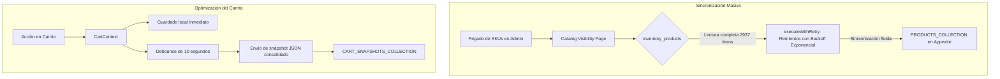

# 💎 YAXSEL STORE — MANUAL DE INGENIERÍA Y README DEFINITIVO

⚠️ **PROPRIETARY CODE & ARCHITECTURE - PROPERTY OF YRASERXD**

Bienvenido al manual definitivo de arquitectura, diseño e ingeniería de **Yaxsel Store**. Este documento representa la síntesis de una auditoría profunda sobre el estado legado del proyecto (*Análisis Low Level*), la evaluación de sus actualizaciones más recientes, y mi perspectiva crítica como Arquitecto de Software Principal para guiar la evolución de esta plataforma hacia un estándar de clase mundial en 2026.

---

## 🏛️ 1. MAPEO DE ARQUITECTURA GENERAL Y DE DIRECTORIOS

El proyecto está diseñado bajo un modelo híbrido basado en **Next.js 15 (App Router)** y **Appwrite Cloud** como Backend-as-a-Service (BaaS). Su flujo de enrutamiento y renderizado es responsivo y dinámico, apoyándose en selectores de plantillas y layouts acoplados por inyección de contextos globales.

```
web-store/
├── src/
│   ├── app/                    # Next.js App Router (Páginas + API routes)
│   │   ├── admin/(panel)/      # Panel administrativo Shopify-Dark (35+ módulos)
│   │   │   ├── layout.tsx      # Sidebar oscuro animado con GSAP
│   │   │   └── modules/        # Controladores individuales de negocio
│   │   ├── api/                # Endpoints del lado del servidor (Next.js Edge/Serverless)
│   │   │   ├── ai-sidekick/    # Lógica de comunicación con Gemini y acciones autónomas
│   │   │   └── template/       # Resolver de la plantilla global activa
│   │   ├── carrito/            # Página de cesta de compras
│   │   ├── catalogo/           # Catálogo exclusivo para consultar disponibilidad (out-of-stock)
│   │   ├── productos/          # Lista pública de productos en stock inmediato
│   │   ├── layout.tsx          # Layout raíz y Providers de contexto global
│   │   └── page.tsx            # Homepage condicional basada en templates
│   ├── components/             # Componentes React reutilizables
│   │   ├── admin/              # UI específica de la administración
│   │   └── [55+ componentes]   # Componentes atómicos y moleculares del cliente
│   ├── context/                # Proveedores de estado y contextos globales (Cart, Auth, Favorites)
│   ├── hooks/                  # Custom hooks de react (useAuth, useAperturaPromotion)
│   ├── lib/                    # SDKs, helpers de caché y algoritmos de formateo
│   ├── services/               # Integración de APIs de negocio (loyalty, notification)
│   ├── templates/              # Estructuras visuales alternativas (Plantilla 1 a 13)
│   └── types/                  # Definiciones estricta de TypeScript
```

### 🔁 Flujo de Renderizado y Resolución Multitemplática
La tienda implementa un novedoso mecanismo de resolución dinámica:

```
[Usuario accede a /]
       │
       ▼
[Providers de Layout Raíz] ── AuthProvider, CartProvider, FavoritesProvider, TemplateProvider
       │
       ▼
[TemplateProvider] ── Consulta '/api/template' (Server Key de Appwrite o Parámetro '?_tpl=N')
       │
       ▼
[StoreShell] ── Carga de dynamic stylesheets e inyección de 'data-template="N"' en body
       │
       ▼
[DynamicHomePage] ── Switch condicional que renderiza la plantilla seleccionada (de 1 a 13)
```

---

## 🔍 2. SÍNTESIS DEL ANÁLISIS LEGADO (LOW LEVEL ANALYSIS)

El análisis profundo del estado histórico del proyecto reveló varios puntos críticos de deuda técnica, agrupados por su nivel de severidad:

### 🚨 Issues Críticos Detectados
1.  **Archivos Monolíticos:** 
    *   `templates/plantilla1/HomePage.tsx` superaba los **416 KB (~12,000 líneas)**. Albergaba código HTML directamente migrado de un tema de Shopify (Venice) con mezcla de lógica de negocio, hooks de React, manipulación directa de DOM y animaciones GSAP.
    *   `templates/plantilla2/Navbar.tsx` (**126 KB**) y `lib/section-config.ts` (**60 KB**) concentraban demasiadas responsabilidades simultáneas.
2.  **Manipulación DOM Directa:** Se detectaron múltiples llamadas a `document.querySelector` y operaciones imperativas sobre clases CSS dentro de componentes React, lo que generaba *race conditions* con el Virtual DOM e impedía una correcta limpieza en el desmontaje del componente.
3.  **Claves de API Expuestas:** Existencia de tokens y credenciales de Appwrite en el código del servidor en lugar de usar variables de entorno seguras (`.env.local`).
4.  **Error 500 del Tracker:** El componente `usePageViewTracker.ts` intentaba escribir en la colección `page_views`, la cual no existía en la instancia de Appwrite, arrojando errores constantes en consola.
5.  **Tipos TS Inconsistentes:** Duplicidad de propiedades y esquemas con variaciones en mayúsculas y minúsculas entre `types/index.ts` y `types/admin.ts`.

---

## ⚡ 3. EVALUACIÓN DEL PROYECTO ACTUALIZADO (CAMBIOS Y MEJORAS)

El proyecto actual presenta mejoras sustanciales en su rendimiento y lógica interna, solucionando de forma elegante los cuellos de botella de la arquitectura previa:



### 1. Reingeniería en el Flujo de Visibilidad de Catálogo
*   **Antes:** Se intentaban hacer consultas y actualizaciones síncronas de SKUs sin control de flujo, provocando bloqueos constantes por errores HTTP **429 Too Many Requests** del backend de Appwrite.
*   **Ahora:** El módulo administrativo `/admin/catalog-visibility` ahora lee de forma masiva la colección maestra `inventory_products` (los 2937 productos reales de Bodegapp). Implementa la función modular `executeWithRetry`, que maneja un **algoritmo de backoff exponencial** que pausa y reintenta las peticiones cuando Appwrite arroja un código 429. Esto permite importar, activar u ocultar cientos de productos en lote de forma 100% confiable.

### 2. Segmentación de `/productos` y `/catalogo`
*   Se resolvió el error de duplicidad y desbordamiento en el frontend:
    *   **`/productos`** realiza la lectura filtrando estrictamente los productos activos con stock físico inmediato (`STOCK > 0`).
    *   **`/catalogo`** carga únicamente los productos activos sin stock en almacén central (`STOCK <= 0` y `COMING_SOON == false`), actuando de forma exclusiva como catálogo consultivo. El botón de compra tradicional es reemplazado por **"Consultar disponibilidad"**, creando un registro ágil en `stock_alerts` para guiar las compras de bodega del administrador.

### 3. Reducción de Overhead en CartContext
*   **Antes:** La sincronización de carrito persistía cada artículo como fila única en la colección `cart_items` de Appwrite mediante escrituras concurrentes agresivas, deteriorando el rendimiento del cliente.
*   **Ahora:** Se introdujo la colección `cart_snapshots`. Al actualizar el carrito, el cliente guarda inmediatamente en `localStorage` (cero latencia) y ejecuta un **debounce de 10 segundos**. Tras expirar el tiempo de espera, se genera un único documento ligero de snapshot (`itemsJson`) asociado al `userId`. Esto permite al administrador monitorizar carritos activos en tiempo real sin saturar el ancho de banda.

---

## 🛠️ 4. OPINIÓN Y CRÍTICA ARQUITECTÓNICA (SENIOR ARCHITECT REVIEW)

### Aspectos Excepcionales (Fortalezas)
*   **Flexibilidad Multitemplática:** La capacidad de renderizar 13 temas totalmente distintos (`HomePage1` a `HomePage13`) a través de un único `TemplateProvider` es una hazaña de diseño. El soporte de sobrescritura interactiva por URL (`?_tpl=N`) permite que el editor de temas actúe como un SAAS de primer nivel.
*   **Interacción y Engagement Directo:** La inclusión nativa de formatos modernos de interactividad, como **Clips** (estilo TikTok Reels) con adición directa al carrito y **Sorteos en Vivo**, sitúa a Yaxsel muy por delante de los e-commerce tradicionales y estáticos.
*   **Yexy: Asistente Autónomo Innovador:** La integración de la API local `/api/ai-sidekick` con Gemini es brillante. La capacidad de la IA de entender lenguaje natural, procesar imágenes adjuntas, extraer URLs reales de almacenamiento para evitar alucinaciones, y responder con bloques `[ACTION:CREATE_PRODUCT]` que el frontend interpreta de forma autónoma es un patrón de ingeniería sobresaliente.

### Áreas de Mejora Prioritarias (Debilidades y Riesgos)
*   **Bundle Size y Carga Inicial:** El e-commerce importa librerías extremadamente pesadas de forma global (`three.js`, `fabric.js`, `konva.js`, `tsparticles`). Al no modularizarse la carga de estos assets, la primera pintura del sitio en dispositivos móviles con baja velocidad de conexión podría verse degradada.
*   **Inconsistencias en Esquemas:** Mantener atributos en mayúsculas (`STOCK`, `PRICE`, `ISACTIVE`) junto con otros en camelCase o minúsculas (`categoryId`, `wholesalePrice`) introduce fricción al escribir código y aumenta la posibilidad de bugs en producción.
*   **Falta de Pruebas Automatizadas:** La ausencia total de unit tests para el core de lógica (como los servicios de lealtad, cálculo de cupones y los algoritmos de reintento masivo) pone en riesgo la estabilidad ante futuras actualizaciones de Next.js o del SDK de Appwrite.

---

## 🚀 5. ROADMAP EVOLUTIVO: PATRONES PARA LLEVAR A YAXSEL AL NIVEL MUNDIAL

Para transformar Yaxsel Store en una plataforma tecnológica de vanguardia y obtener un rendimiento sobresaliente en Core Web Vitals, se propone la adopción de los siguientes patrones avanzados:

### 1. Dynamic Imports & Lazy Loading (Optimización del Bundle)
Para mitigar el peso de librerías como Three.js y Fabric, el framework debe importar estos módulos **únicamente bajo demanda**.

```typescript
// src/components/ProductCustomizer.tsx
import dynamic from 'next/dynamic';

// Importa Fabric.js de manera diferida, sin sobrecargar la carga inicial del Home
const FabricCanvas = dynamic(
  () => import('@/components/canvas/FabricCanvasComponent'),
  { 
    ssr: false, 
    loading: () => <SkeletonCanvas /> 
  }
);
```

### 2. Arquitectura de Tipos Limpios y Heredados
Unificar los archivos `types/index.ts` y `types/admin.ts` en un modelo estructurado bajo TypeScript que separe las entidades base de aquellas exclusivas de la administración:

```typescript
// src/types/store.ts
export interface BaseProduct {
  $id: string;
  name: string;
  sku: string;
  price: number;
  stock: number;
  imageUrl: string;
}

// src/types/admin.ts
import { BaseProduct } from './store';

export interface AdminProduct extends BaseProduct {
  cost: number;
  restockThreshold: number;
  wholesalePrice: number;
  internalCode: string;
}
```

### 3. Invalidación Inteligente de Caché de Productos
El sistema actual almacena productos en memoria por 15 minutos sin control de purga. Se debe implementar un trigger en los endpoints del panel de control que purgue la caché local cuando el administrador guarde cambios:

```typescript
// src/lib/cache.ts
class CacheEngine {
  private store = new Map<string, { value: any; expires: number }>();

  set(key: string, value: any, ttlSeconds: number) {
    this.store.set(key, { value, expires: Date.now() + (ttlSeconds * 1000) });
  }

  get(key: string) {
    const data = this.store.get(key);
    if (!data) return null;
    if (Date.now() > data.expires) {
      this.store.delete(key);
      return null;
    }
    return data.value;
  }

  // Purga de llaves específicas al actualizar
  invalidatePattern(pattern: RegExp) {
    for (const key of this.store.keys()) {
      if (pattern.test(key)) {
        this.store.delete(key);
      }
    }
  }
}
```

---

## ⚙️ 6. GUÍA DE INSTALACIÓN Y DESPLIEGUE PARA DESARROLLADORES

### Requisitos Previos
*   **Node.js**: v18.0 o superior (Recomendado v20+).
*   **NPM / PNPM** configurado.

### Configuración Local
1.  Clona el repositorio en tu espacio local.
2.  Instala las dependencias necesarias:
    ```bash
    npm install
    ```
3.  Crea un archivo `.env.local` en la raíz del proyecto y añade tus variables privadas:
    ```env
    NEXT_PUBLIC_APPWRITE_ENDPOINT=https://nyc.cloud.appwrite.io/v1
    NEXT_PUBLIC_APPWRITE_PROJECT_ID=6a0a4e8d0032177f3f90
    NEXT_PUBLIC_APPWRITE_DATABASE_ID=6a0a58ca001798410d86
    GEMINI_API_KEY=tu_gemini_api_key_aqui
    ```
4.  Inicia el servidor de desarrollo:
    ```bash
    npm run dev
    ```
    El servidor correrá en [http://localhost:3003](http://localhost:3003).

### Despliegue en Producción
El despliegue está configurado para ejecutarse en **Netlify** o **Vercel** mediante el archivo `netlify.toml`. 

Para generar la compilación de producción optimizada:
```bash
npm run build
```
Esta orden transpilará el código TypeScript, resolverá las rutas estáticas de Next.js y aplicará las optimizaciones de minimización de código y CSS.
